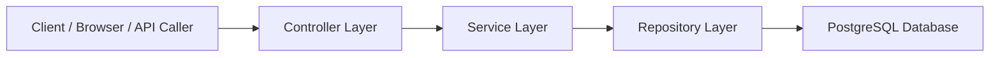

# E-Commerce Backend

<p align="center">
  
  
  
  
</p>

<p align="center">
  <strong>Developed and maintained by Ganesh Kumar Maddi</strong>
</p>

This project is a backend-focused e-commerce service built with Spring Boot and PostgreSQL. It follows a layered architecture and demonstrates real-world backend concepts such as REST APIs, JPA persistence, entity modeling, service logic, validation, and database integration in a scalable and maintainable structure.

## Table of contents

- [Overview](#overview)
- [Core features](#core-features)
- [Tech stack](#tech-stack)
- [Architecture](#architecture)
- [Project structure](#project-structure)
- [Quick start](#quick-start)
- [API endpoints](#api-endpoints)
- [Roadmap](#roadmap)
- [Ownership](#ownership)

## Overview

This repository contains a backend service for an e-commerce platform and is designed as a learning-focused, production-style codebase. The application is structured around clear separation between controller, service, repository, and entity responsibilities, making it easy to extend with new features and modules.

The project is intentionally built in stages so each milestone adds practical backend patterns and production-oriented best practices.

## Core features

| Feature | Description |
| --- | --- |
| Spring Boot foundation | Application setup and structure for a modern Java backend |
| PostgreSQL integration | Data persistence with a cloud-ready relational database |
| Product domain model | Entity definition and validation metadata |
| Repository layer | Data access using Spring Data JPA |
| Service layer | Business logic and processing between controllers and repositories |
| REST APIs | CRUD endpoints for products and common ecommerce flows |
| Health endpoint | Basic `/hello` monitoring and validation endpoint |
| Extensible design | Ready to expand with cart, orders, auth, DTOs, and deployment features |

## Tech stack

| Layer | Technology |
| --- | --- |
| Language | Java 17 |
| Framework | Spring Boot |
| Persistence | Spring Data JPA, Hibernate |
| Database | PostgreSQL |
| Build tool | Maven |
| Version control | Git, GitHub |

## Architecture



## Project structure

```text
ecommerce-backend/
├── src/
│   └── main/
│       └── java/
│           └── com/example/ecommerce/
│               ├── controller/
│               ├── service/
│               ├── repository/
│               ├── entity/
│               ├── EcommerceApplication.java
│               └── ...
├── src/main/resources/
├── mvnw
├── mvnw.cmd
├── pom.xml
├── README.md
└── LICENSE
```

## Quick start

### Prerequisites

- Java 17 or higher
- Maven or Maven Wrapper
- PostgreSQL database access
- Git

### Clone the repository

```bash
git clone https://github.com/ganeshkmmaddu/ecommerce-backend.git
cd ecommerce-backend
```

### Configure database connection

Update your PostgreSQL settings in the application config file:

```properties
spring.datasource.url=jdbc:postgresql://<host>:5432/<database>
spring.datasource.username=<your-username>
spring.datasource.password=<your-password>

spring.jpa.hibernate.ddl-auto=update
spring.jpa.show-sql=true
spring.jpa.properties.hibernate.dialect=org.hibernate.dialect.PostgreSQLDialect
```

### Run the app

```bash
./mvnw spring-boot:run
```

Then open:

```text
http://localhost:8080
```

## API endpoints

### Hello endpoint

| Method | Endpoint | Description |
| --- | --- | --- |
| GET | `/hello` | Health/test response |

### Product endpoints

| Method | Endpoint | Description |
| --- | --- | --- |
| POST | `/api/products` | Create a new product |
| GET | `/api/products` | Retrieve all products |
| GET | `/api/products/{id}` | Retrieve a product by ID |
| PUT | `/api/products/{id}` | Update product details |
| DELETE | `/api/products/{id}` | Delete a product |

### Example: create product

```bash
curl -X POST http://localhost:8080/api/products \
  -H "Content-Type: application/json" \
  -d '{
    "name": "Wireless Mouse",
    "description": "Ergonomic wireless mouse",
    "price": 29.99,
    "stockQuantity": 50
  }'
```

## Roadmap

Planned enhancements include:

- DTO layer
- validation improvements
- global exception handling
- category module
- cart module
- order module
- JWT authentication
- Spring Security
- React frontend
- deployment support for cloud hosting

## Ownership

This repository was created and developed as a personal project by Ganesh Kumar Maddi.

The project is structured as a practical, production-inspired backend service for e-commerce learning and portfolio demonstration, with a clear path toward more advanced features and deployment readiness.

## License

This project is provided for learning and demonstration purposes. Add a formal license if you plan to distribute or commercialize it.
